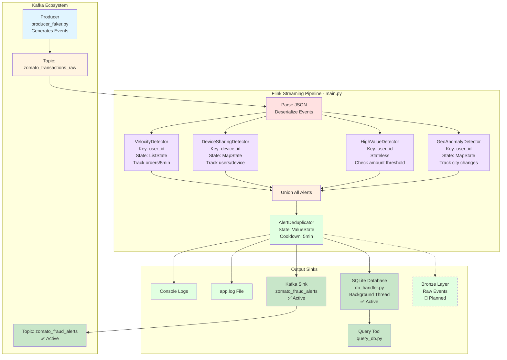

# Real-Time Fraud Detection with Apache Flink

A streaming fraud detection system for food delivery platforms using Apache Flink with stateful processing, pattern detection, and Kafka integration.

---

## Architecture



---

## How It Works

### 1. Event Generation

**Producer** (`kafka/producer_faker.py`) generates fake Zomato transactions:

- 80% normal behavior (single device per user, reasonable amounts)
- 20% fraud simulation (shared devices, high velocity orders)

### 2. Stream Processing

**Flink Pipeline** (`pipeline/main.py`) processes events in real-time:

1. **Kafka Source** → Read from `zomato_transactions_raw` topic
2. **Parse JSON** → Convert to Python dict
3. **Apply 4 Fraud Detectors** (runs in parallel):
   - **VelocityDetector**: >3 orders in 5 minutes → HIGH risk
   - **DeviceSharingDetector**: >3 users per device → CRITICAL risk
   - **HighValueDetector**: Amount >₹1500 → MEDIUM risk
   - **GeoAnomalyDetector**: Different cities in 10 minutes → HIGH risk
4. **Union Alerts** → Merge all fraud signals
5. **Deduplicate** → Prevent alert spam (5-minute cooldown)
6. **Dual Output** → Publish to Kafka + Store in SQLite
   - **Kafka Sink**: Publish to `zomato_fraud_alerts` topic (for downstream consumers)
   - **Database**: Store in SQLite via background thread (for historical analysis)

### 3. State Management

Flink maintains **keyed state** per user/device:

- **ListState**: Order timestamps (VelocityDetector)
- **MapState**: User→timestamp maps (DeviceSharingDetector, GeoAnomalyDetector)
- **ValueState**: Last alert time (AlertDeduplicator)

State enables temporal pattern detection (e.g., "5 orders in last minute").

### 4. Database Storage

**Database Handler** (`pipeline/db_handler.py`) manages persistent storage:

- **SQLite Database**: Local file-based storage (`fraud_alerts.db`)
- **Background Thread**: Non-blocking writes using Python threading
- **Queue-based Architecture**: Thread-safe alert buffering
- **Batch Processing**: Writes 10 alerts at once for efficiency
- **Indexed Schema**: Fast queries by user, type, severity, timestamp

**Schema:**

```sql
CREATE TABLE fraud_alerts (
    id INTEGER PRIMARY KEY,
    alert_type TEXT,
    user_id TEXT,
    device_id TEXT,
    severity TEXT,
    amount REAL,
    message TEXT,
    detected_at INTEGER,
    alert_data TEXT (JSON)
)
```

---

## Setup & Installation

### Prerequisites

- Python 3.9+
- Java 11 (required by Flink)
- Kafka + Zookeeper

### Install Dependencies

```bash
# Create virtual environment
python -m venv venv
source venv/bin/activate  # On Windows: venv\Scripts\activate

# Install packages
pip install apache-flink==1.18.1 kafka-python faker tabulate
```

### Start Kafka

```bash
# Option 1: Docker
docker run -d --name kafka -p 9092:9092 apache/kafka:latest

# Option 2: Local installation
# Download from https://kafka.apache.org/downloads
# Start Zookeeper + Kafka broker
```

### Create Kafka Topic

```bash
kafka-topics --create \
  --topic zomato_transactions_raw \
  --bootstrap-server localhost:9092 \
  --partitions 4 \
  --replication-factor 1
```

---

## Running the System

### Step 1: Start Kafka Producer

Open **Terminal 1**:

```bash
cd kafka/
python producer_faker.py
```

You'll see transaction events being generated.

### Step 2: Start Flink Pipeline

Open **Terminal 2**:

```bash
cd pipeline/
python main.py
```

**Expected Output**:

```
================================================================================
🚀 Starting Real-Time Fraud Detection System for Zomato Orders
================================================================================
📊 Configuration:
   • Velocity Threshold: 3 orders in 5 minutes
   • Device Sharing Threshold: 3 users per device
   • High Value Threshold: ₹1500.0
   • Geo Anomaly Window: 10 minutes
================================================================================

[17:05:32] 📦 Transaction | User: u_15 | Amount: ₹287.50 | Device: d_8 | City: Mumbai | Behavior: normal

⚠️ [17:05:45] FRAUD ALERT - VELOCITY_FRAUD ⚠️
   Severity: HIGH
   Message: User u_23 placed 4 orders in 5 minutes
   Details: {
       "user_id": "u_23",
       "order_count": 4,
       "threshold": 3,
       ...
   }
```

### Step 3: Check Logs

All output is saved to `pipeline/app.log`:

```bash
tail -f pipeline/app.log
```

### Step 4: Monitor Kafka Alerts Sink

Open **Terminal 3** to see alerts published to Kafka:

```bash
kafka-console-consumer --topic zomato_fraud_alerts --bootstrap-server localhost:9092
```

### Step 5: Query Database

Open **Terminal 4** to analyze stored alerts:

```bash
cd pipeline/

# Show statistics
python query_db.py stats

# Show recent 20 alerts
python query_db.py all

# Show alerts for specific user
python query_db.py user u_49

# Show high priority alerts
python query_db.py high

# Show alerts by type
python query_db.py type VELOCITY_FRAUD
```

**Example Output:**

```
📊 Fraud Detection Statistics
============================================================
Total Alerts: 127

📈 Alerts by Type:
   • DEVICE_SHARING_FRAUD: 45
   • VELOCITY_FRAUD: 38
   • HIGH_VALUE_FRAUD: 28
   • GEO_ANOMALY_FRAUD: 16

⚠️  Alerts by Severity:
   • CRITICAL: 45
   • HIGH: 54
   • MEDIUM: 28

👤 Top 5 Users with Most Alerts:
   • u_fraud_shared: 12 alerts
   • u_23: 8 alerts
   • u_49: 7 alerts

⏰ Alerts in Last Hour: 23
============================================================
```

---

## Configuration

Edit `pipeline/main.py` to adjust thresholds:

```python
# Fraud detection thresholds
VELOCITY_THRESHOLD = 3              # max orders per user in time window
VELOCITY_WINDOW_MINUTES = 5         # time window for velocity check
HIGH_VALUE_THRESHOLD = 1500.0       # amount threshold (₹)
DEVICE_SHARING_THRESHOLD = 3        # max users per device
GEO_ANOMALY_WINDOW_MINUTES = 10     # time window for geo checks

# Flink configuration
env.set_parallelism(4)              # parallel processing instances
```

---

## Key Flink Concepts Used

### 1. Stateful Stream Processing

- **ListState**: Track sequences (order timestamps)
- **MapState**: Track key-value pairs (users per device)
- **ValueState**: Track single values (last alert time)

### 2. Keyed Streams

Data partitioned by key (user_id, device_id) for parallel processing.

### 3. KeyedProcessFunction

Custom stateful operators with `open()` and `process_element()` methods.

### 4. Event-Time Processing

Uses event timestamps (`event_time` field), not processing time.

### 5. Stream Transformations

- `map()`: Parse JSON, print events
- `filter()`: Remove invalid events
- `union()`: Merge alert streams
- `key_by()`: Partition by key

---

## Troubleshooting

### Warnings on Startup

These are **harmless** and can be ignored:

```
UserWarning: pkg_resources is deprecated as an API
INFO] No module named google.cloud.bigquery_storage_v1
```

### Kafka Connection Error

```
KafkaTimeoutError: Failed to bootstrap
```

**Solution**: Ensure Kafka is running on `localhost:9092`

### No Alerts Appearing

**Solution**: Check producer is running and generating fraud events (20% fraud rate)

### Database Query Error: "no such table"

**Solution**: Run the pipeline once first - database is auto-created on startup

### Kafka Sink Error: "Topic does not exist"

**Solution**: Create the alerts topic:

```bash
kafka-topics --create \
  --topic zomato_fraud_alerts \
  --bootstrap-server localhost:9092 \
  --partitions 4 \
  --replication-factor 1
```

---

## Completed Features

- [x] **Real-time Fraud Detection**: 4 pattern detectors with stateful processing
- [x] **Kafka Integration**: Source and sink connectors
- [x] **SQLite Database**: Persistent storage with background threading
- [x] **Alert Deduplication**: 5-minute cooldown per user
- [x] **Query Tool**: CLI for database analysis
- [x] **Dual Logging**: Console + file output

## Planned Enhancements

- [ ] **Bronze Layer Sink**: Write raw events to data lake (Parquet)
- [ ] **Checkpointing**: Enable fault tolerance with state snapshots
- [ ] **State TTL**: Auto-cleanup old state to prevent memory growth
- [ ] **Metrics Dashboard**: Real-time visualization with Grafana
- [ ] **ML-based Detection**: Anomaly detection with trained models
- [ ] **Alert Notifications**: Email/Slack integration for CRITICAL alerts

---

## Project Structure

```
miniproject/
├── kafka/
│   └── producer_faker.py      # Generates fake transactions
├── pipeline/
│   ├── main.py                # Main Flink pipeline (stateful detectors)
│   ├── db_handler.py          # SQLite database with threading
│   ├── query_db.py            # Database query CLI tool
│   ├── app.log                # Output logs (auto-created)
│   └── fraud_alerts.db        # SQLite database (auto-created)
└── Readme.md                  # This file
```

---

## Key Technologies

- **Apache Flink 1.18.1**: Stream processing with stateful operators
- **PyFlink**: Python API for Flink DataStream
- **Kafka 3.x**: Distributed event streaming
- **SQLite**: Lightweight embedded database
- **Threading**: Background database writes
- **Python 3.10**: Core application language

---

**Built with**: Apache Flink 1.18.1 | Python 3.10 | Kafka 3.x | SQLite
